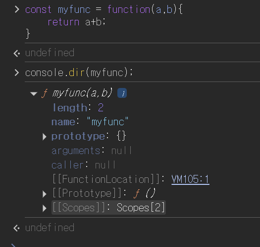

# 함수와 일급 객체
## 목차
- [](#)


### 일급 객체
- 다음과 같은 조건을 만족하는 객체를 `일급 객체`라고 한다
    1. 무명의 리터럴로 생성할 수 있다. 즉, 런타임에 생성이 가능하다
    2. 변수나 자료구조(객체, 배열 등)에 저장할 수 있다.
    3. 함수의 매개변수에 전달할 수 있다.
    4. 함수의 반환값으로 사용할 수 있다.
    ```javascript
    // 1. 무명의 리터럴로 생성할 수 있다.
    // 2. 함수는 변수에 저장할 수 있다.
    // 런타임(할당 단계)에 함수 리터럴이 평가되어 함수 객체가 생성되고 변수에 할당된다.
    const increase = function(num){
        return ++num;
    };
    const decrease = function(num){
        return --num;
    };
    // 2. 함수는 객체에 저장할 수 있다.
    const auxs = {increase, decrease};
    // 3. 함수의 매개변수에 전달할 수 있다.
    // 4. 함수의 반환값으로 사용할 수 있다.
    function makeCounter(aux){
        let num = 0;

        return function(){
            num = aux(num);
            return num;
        };
    }

    // 3. 함수는 매개변수에 함수를 전달할 수 있다.
    const increaser = makeCounter(auxs.increase);
    console.log(increaser()); // 1
    console.log(increaser()); // 2

    // 3. 함수는 매개변수에 함수를 전달할 수 있다.
    const decreaser = makeCounter(auxs.decrease);
    console.log(decreaser()); // -1
    console.log(decreaser()); // -2
    ```
    - 함수는 값을 사용할 수 있는 곳(변수 할당문, 객체의 프로퍼티 값, 배열의 요소, 함수 호출의 인수, 함수 반환문)이라면 어디서든지 리터럴로 정의할 수 있으며, 런타임에 함수 객체로 평가된다.
    - 이는 함수형 프로그래밍을 가능케 하는 자바스크립트의 장점 중 하나다.
### 함수 객체의 프로퍼티
- 함수는 객체이므로 함수도 프로퍼티를 가질 수 있다. 브라우저에서 `console.dir()`을 활용하면 객체 내부를 알 수 있음.
    
- 내부를 살펴보면 length, name, prototype, arguments, caller 프로퍼티는 모두 함수 객체의 데이터 프로퍼티다. 
- 이들 프로퍼티는 일반 객체에는 없는 함수 객체 고유의 프로퍼티이다.
- `__proto__`는 Object.prototype 객체의 접근자 프로퍼티다. 모든 객체는 이 프로퍼티를 상속받아 사용할 수 있다. (19장에서 자세히...)

1. `arguments` 프로퍼티
    - arguments 프로퍼티의 값은 arguments 객체다.
    - 함수 호출 시, 전달된 인수들의 정보를 담고 있는 순회 가능한 유사 배열 객체이며, 함수 내부에서 지역 변수처럼 사용된다.
    - 일부 브라우저에서 지원하고 있으나 ES3부터 표준에서 폐지되어 Function.arguments 와 같은 사용법은 권장되지 않는다.
        ```javascript
        function multiply(x,y){
            console.log(arguments);
            return x*y;
        }
        console.log(multiply()); // NaN
        console.log(multiply(1)); // NaN
        console.log(multiply(1,2)); // 2
        console.log(multiply(1,2,3)); // 2
        ```
    - 인수가 전달되지 않은 매개변수는 undefined로 초기화된 상태를 유지한다.
    - 초과된 인수는 무시된다. 그냥 버려지는 것은 아니고 arguments 객체에 보관된다.
    - arguments 객체는 인수를 프로퍼티 값으로 소유하며, 스로퍼티 키는 인수의 순서를 나타낸다.
    - callee 프로퍼티는 호출되어 arguments 객체를 생성한 함수, 즉 함수 자신을 가리킴.
    - length 프로퍼티는 인수의 개수를 가리킴
    - 인수의 개수를 확인하지 않는 자바스크립트의 특성때문에 이럴 때 유용함.
        ```javascript
        function sum(){
            let res = 0;
            // arguments 객체는 length 프로퍼티가 있는 유사 배열 객체이므로 for 문으로 순회할 수 있다.
            for(let i = 0;i<arguments.length;i++){
                res+=arguments[i];
            }
            return res;
        }
        ```
    - 유사 배열 객체이므로 배열 메서드를 사용할 경우 에러가 발생함.
    - Rest 파라미터 도입으로 인해 중요성이 감소했다고 함.(26장에서 자세히...)
2. `caller`프로퍼티
    - caller 프로퍼티는 ECMAScript 사양에 포함되지 않은 비표준 프로퍼티다. 지나쳐도 좋다.
3. `length`프로퍼티
    - 함수를 정의할 때 선언한 매개변수의 개수를 가리킨다.
    - 함수 객체의 length 프로퍼티는 매개변수의 개수를 가리키지만
    - arguments 객체의 length 프로퍼티는 인자의 개수를 가리킨다.
4. `name`프로퍼티
    - ES6부터 표준 프로퍼티가 되었다.
    - 함수의 이름을 나타낸다. ES5의 에서는 익명함수의 경우 빈 문자열을 값으로 갖고, ES6에서는 함수 객체를 가리키는 식별자를 값으로 갖는다.
5. `__proto__`접근자 프로퍼티
    - 모든 객체는 `[[Prototype]]`이라는 내부 슬롯을 갖는다. 내부 슬롯은 객체지향 프로그래맹의 상속을 구현하는 프로토타입 객체를 가리킨다. (19장에서 자세히...)
    - `__proto__`프로퍼티는 `[[Prototype]]`내부 슬롯이 가리키는 프로토타입 객체에 접근하기 위해 사용하는 접근자 프로퍼티다.
    - 내부 슬롯에 직접 접근할 수는 없고 간접적인 접근 방법을 제공하는 경우에 한하여 접근할 수 있다.
6. `prototype`프로퍼티
    - `prototype`프로퍼티는 생성자 함수로 호출할 수 있는 함수 객체, 즉 constructor 만이 소유하는 프로퍼티다. 일반 객체와 생성자 함수로 호출할 수 없는 non-constructor에는 prototype 프로퍼티가 없다.
    - `prototype`프로퍼티는 함수가 객체를 생성하는 생성자 함수로 호출될 때 생성자 함수가 생성할 인스턴스의 프로토타입 객체를 가리킨다.